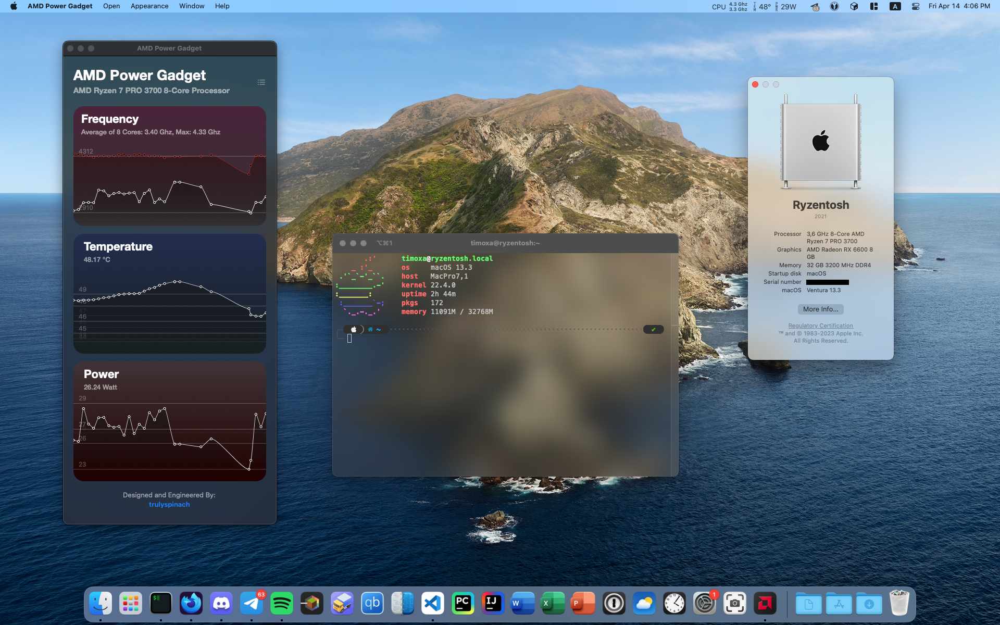

# RyzentoshEFI

## Hardware:
- CPU: AMD Ryzen 7 PRO 3700
- GPU: AMD Radeon RX 6600 8 GB
- RAM: 4x 8 GB 3200 MHz
- Motherboard: Gigabyte B550M AORUS PRO-P
- Audio Codec: ALC1200 / Disabled in  BIOS / USB Headset
- Ethernet Card: Realtek RTL8125B
- Wifi/BT Card: None
- BIOS revision: Latest / f15d
## Details:
- Bootloader: OpenCore 0.9.1
- Guide followed: [dortania's OpenCore Install Guide](https://dortania.github.io/OpenCore-Install-Guide/)
- What's working: Absolutely all what I need + iCloud
- What's not: All AppleHV Hypervisors (VirtualBox 6.x works on Ventura with some [hacks](https://forum.amd-osx.com/threads/virtual-machine-software-that-works-with-amd-hackintoshes.3460/post-26028))
- Kexts used:
  - [Lilu](https://github.com/acidanthera/Lilu)
  - [Virtual SMC](https://github.com/acidanthera/VirtualSMC)
  - [Whatever Green](https://github.com/acidanthera/WhateverGreen)
  - [Apple MCE Reporter Disabler](https://github.com/acidanthera/bugtracker/files/3703498/AppleMCEReporterDisabler.kext.zip)
  - [Restrict Events](https://github.com/acidanthera/RestrictEvents)
  - [AMD Ryzen CPU Power Management + SMC AMD Processor](https://github.com/trulyspinach/SMCAMDProcessor)
  - [Radeon Sensors + SMC Radeon GPU](https://github.com/aluveitie/RadeonSensor)
  - [Lucy RTL8125 Ethernet](https://github.com/Mieze/LucyRTL8125Ethernet)
  - [USB ToolBox](https://github.com/USBToolBox/tool)

